# 											工具类

### 一、Math类

- 数学类：低等数学的操作类

- 较为常用：

  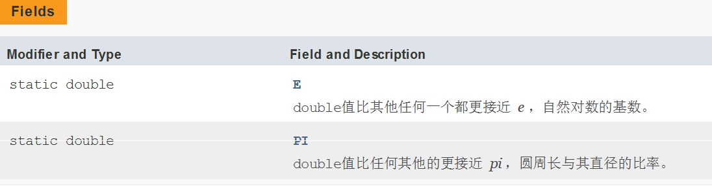

  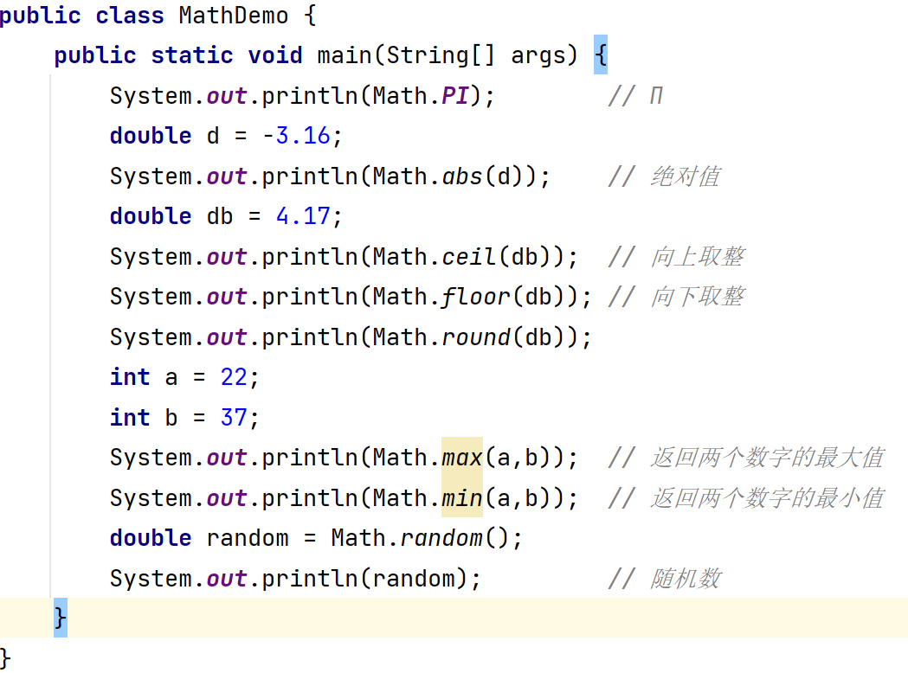

### 二、包装类

- 为何会出现包装类：Java 是面向对象编程，所以我们会将所有的事物都堪称对象。通过对象调用具体的属性方法来运行程序。但是基本数据类型无法变为对象。那么也就是无法调用一些方法来做简便操作。也无法实现与引用类型的转换。包装类就是对基本数据类型的封装，将其封装为一个对象。以便我们后续使用。
- 本质上就是对基本数据类型操作。所以包装类也要符合基本数据类型的取值范围。

| 基本数据类型 | 包装类（引用数据类型） |
| ------------ | ---------------------- |
| byte         | Byte                   |
| short        | Short                  |
| int          | Integer                |
| long         | Long                   |
| float        | Float                  |
| double       | Double                 |
| char         | Character              |
| boolean      | Boolean                |

- 我们以Integer为例

  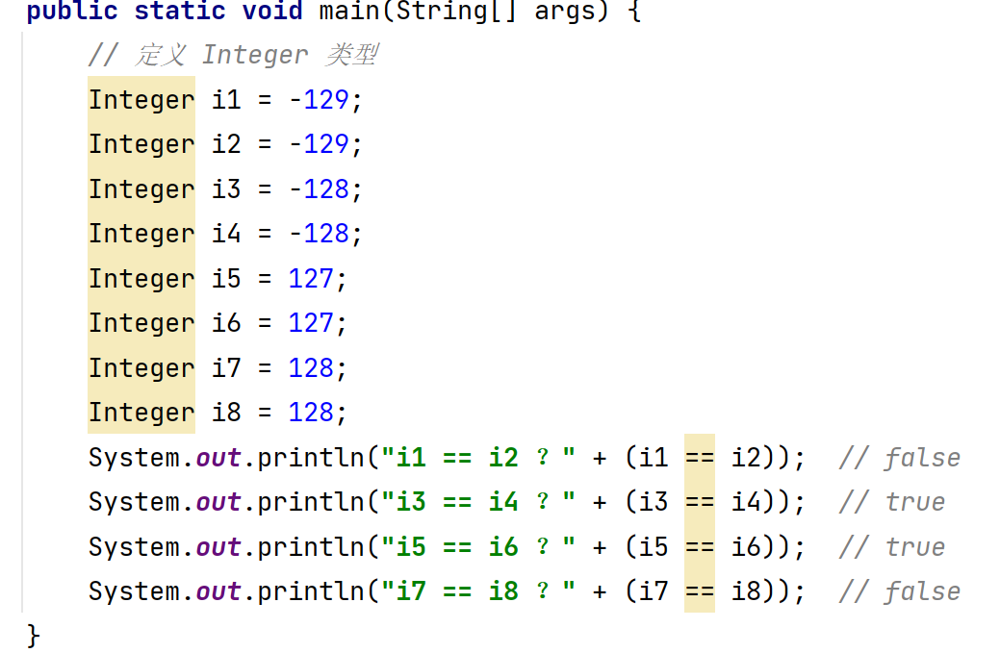

- 代码分析：数值是相邻 ，但是结果确不同。这个体现了 Java 种的木桶效应。由于 Java 中 byte。而 byte 的取值范围是 -128 ~ 127。所以在使用 Integer 赋值时。他只会完成这个区间内的操作“真内存”，也就说若做对比则直接对比值。若超过了这个范围那么将使用 Integer 的构造器完成赋值。那么在用 == 比较将会比较的是地址。

  - 例如在取值范围内  Integer i3 == i4 相当于  int i3 == i4;

  - 若超过了取值范围  Integer i1 = new Integer("-129") 。 Integer i2 = new Integer("-129") 。   i1 == i2  比较的是两个对象的地址

  - 若想比较值，我们需要使用 equals。

    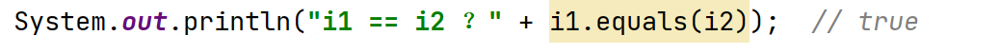

  - 结论就是包装类比较需要使用 equals。

- 包装类的出现就是与基本数据类型和 String 类型进行想换转换的

  - Integer  <==>  int  <==>  String

  - 基本数据类型 --> 包装类的转换

    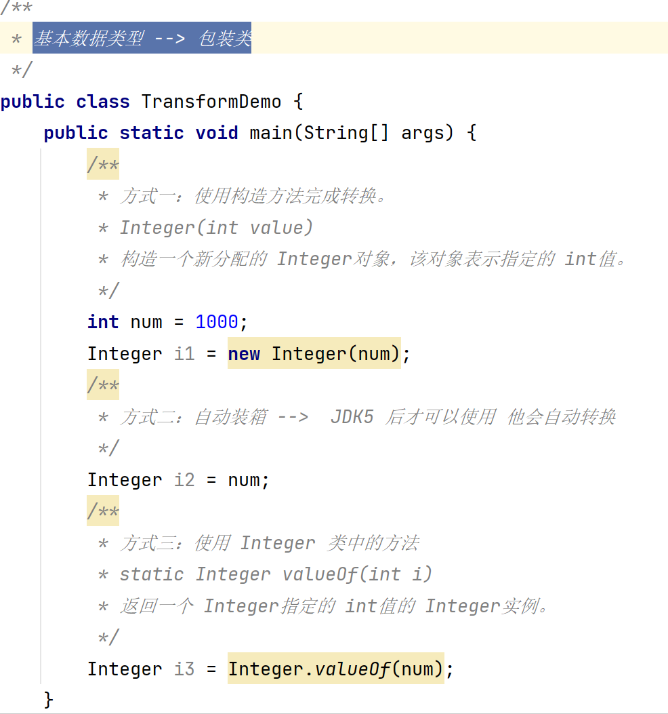

  - 包装类 --> 基本数据类型

    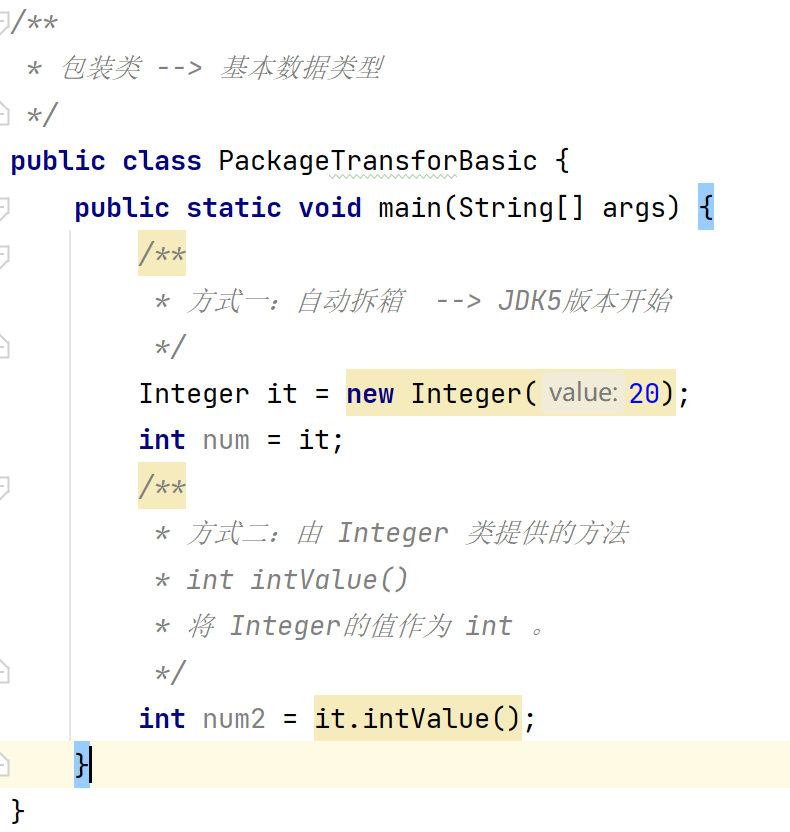

  - 包装类 --> String 字符串

    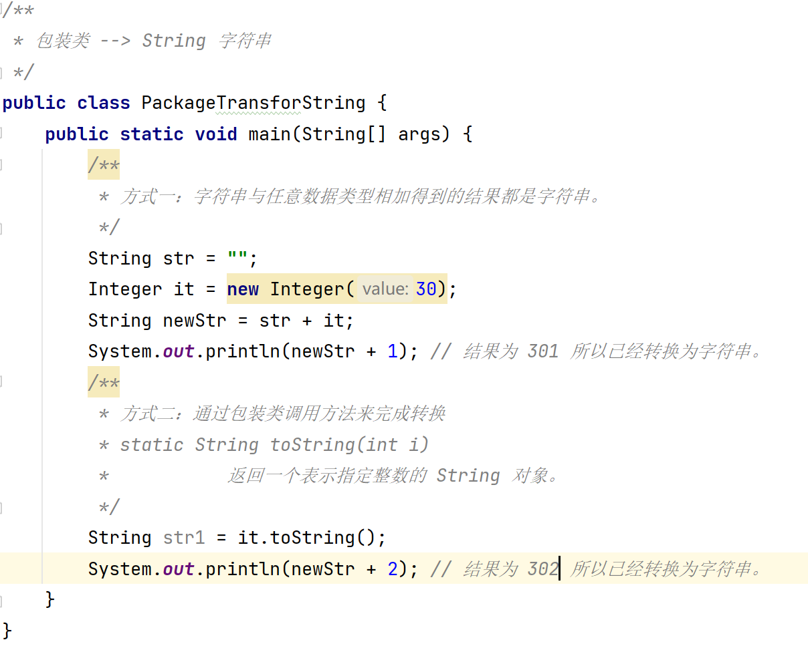

  - String字符串 --> 包装类

    ​	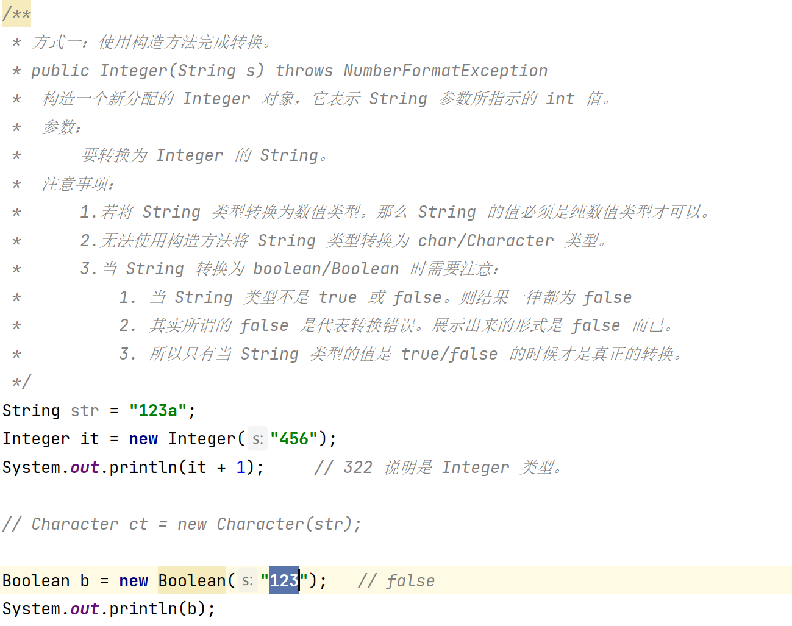

    - 数字格式化异常。说明无法将指定是 String 类型转换为数值类型。

    

    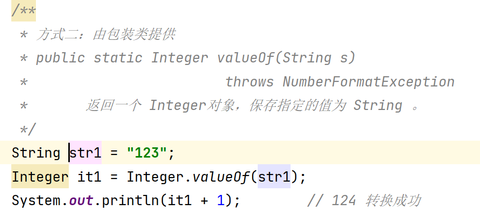

  - 基本数据类型  --> String字符串

    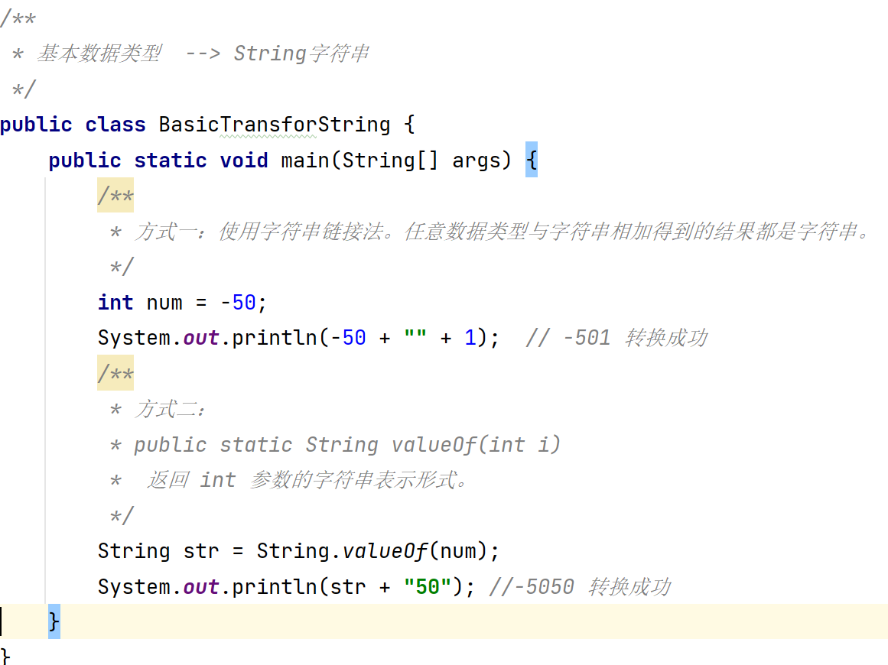

  - String字符串 --> 基本数据类型

    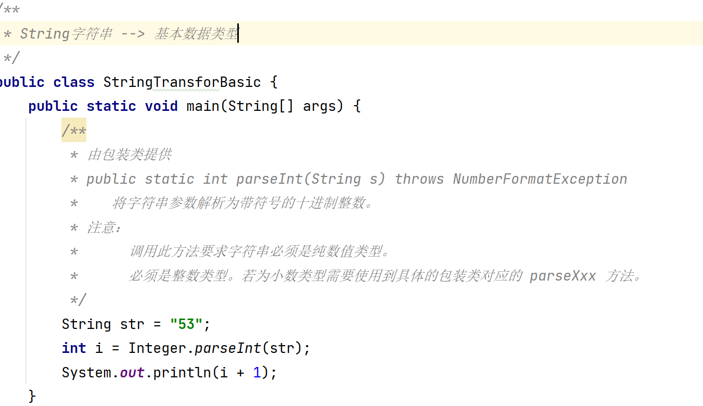

    - 图解三者之间的关系及转换方法的使用

      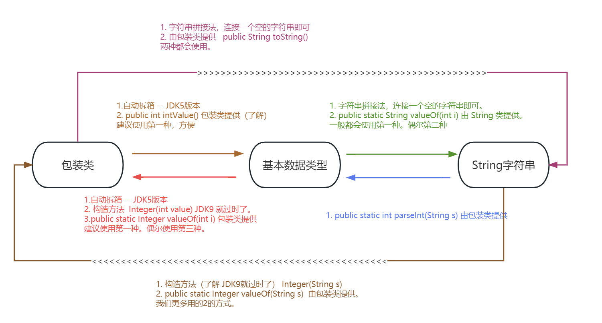

  - 总结：

    - 包装类的出现更多的就是在解决 字符串、包装类、基本数据类型的转换。同时会给我们提供一些便于操作的方法。具体详见 API。

### 三、Object 类

- 江湖地位：

  - Java语言中唯一一个没有父类的类。继承链的最顶端

    - 直接父类：类结构中紧挨着的上一个类就是直接父类。若没有直接写明直接父类，那么该类都继承 Object。

    - 间接父类：类结构中除了接爱着的上一个父类。若父类还存在父类。那么就是间接父类。继承链是可以存在多层的。

      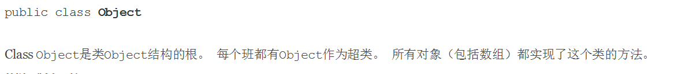

- equals

  - public boolean equals(Object obj) 方法。 指示其他某个对象是否与此对象“相等”。

  - 只能用作引用数据类型进行对比（基本数据类型不能使用）。

  - 若是 Object 类中的 equals 方法，那么底层本质上是对比对象的地址。（比较的是堆内存中的地址）

  - 我们所有的类都继承了 Object。我们可以重写 Object 类中的 equals() 方法。那么则可以按照我们自定义的比较规则来比较（比较对象内的值是否相等）。

    - 没重写 euqals

    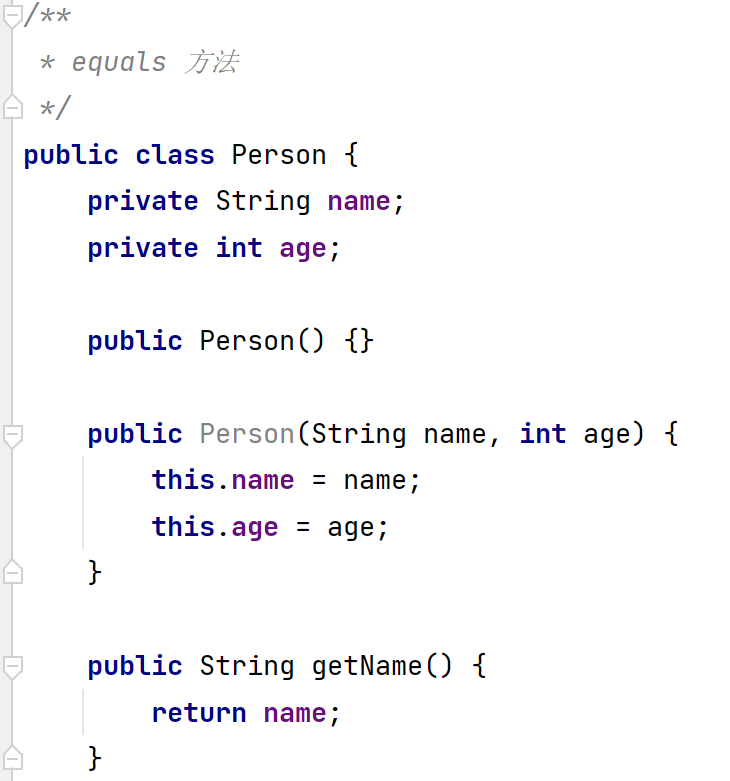

    ​						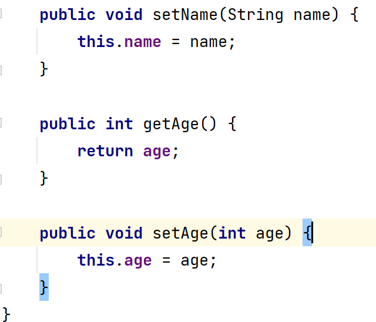

    - 测试类

      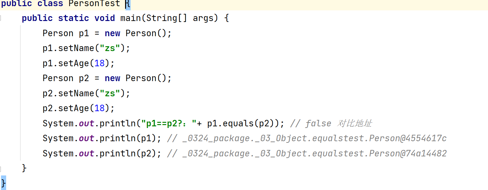

    - 需求是我们需要对比对象是否为同一个人（我们需要比较的是对象的值是否相等）。我们就需要重写 Object 类中的 equals()方法。

      - 我们使用自动生成时。我们发现重写 equals() 方法时还需要重写 HashCode() 方法。（后续讲解HashCode）。

        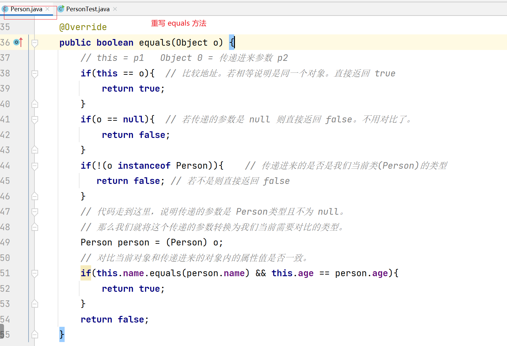

    - 得到的结论：

      - 若想比较地址。那么我们直接调用 equals() 方法即可。若想比较对象内的值是否一致，那么就需要我们自己去重写 equals() 方法。（可以自动生成）。

    - 面试题： == 和 equals() 方法的区别。

      - 当判断基本数据类型的时候。比较的是栈内存空间的值是否一致。所以只能使用 ==。 equals() 方法不能判断基本数据类型。
      - 当判断是引用数据类型时。
        - == 比较的是对象的地址是否一致。（比较的是栈空间中引用的地址是否一致）。
        - equals() 方法若没有被重写。则比较的是地址（与 == 一致）。
        - 若重写了 equals 方法。则按照我们自定义的比较规则（对象的值）来进行对比。

  - HashCode：哈希码。一般会根据一个对象的地址通过某种算法得到了一组数字。

    - Java 中提出：可在生成 equals() 方法前。建议你同时生成 HashCode。这样会提高对比效率。
    - 相同对象的 HashCode 大部分都相同。Java 中真正的对比是先去对比 HashCode 是否一致。若不一致则一定不是一个对象。那么就没有必要在去对比 equals() 了。只有 HashCode 相同的情况下。才有可能是一个对象。在进行重写的 equals() 中值的对比。这样会提高效率。
    - HashCode 本质上他是按照某种算法得到要给结果后。按照大致进行对比。例如：我们要在我们班级找一个叫 Xxx 的女生。那么 HashCode 就类似于先将男女分组。若性别不等于女，则一定不是我们需要找到人。只有性别为女了。才去找 Xxx 这名女生。
    - 面体题：为什么在重写 equals() 方法之前要重写 HashCode？
      - 为了提高 equal() 方法的执行效率。当 HashCode 返回一致的时候，才有可能是一个对象。这样才去调用 equals() 方法。否则直接返回 false。连同一个对象都不是，和谈里面的值是否一致呢。

  - toString。